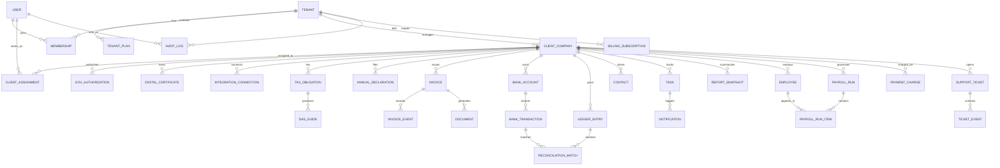
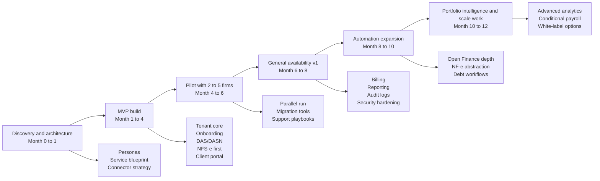

# Analytical Specification Guide for a Multi-Tenant MEI Accounting Web App

## Executive summary

The strongest product opportunity is **not** to clone any one of the three reference sites. It is to combine three patterns that the current market surfaces separately: **MEI-compliance simplification** (MEI Pronto and MaisMei), **light business operations tooling** (Awise), and a **true accountant control plane** for firms that manage many MEI clients at once. Publicly visible positioning suggests that MEI Pronto emphasizes digital accounting and operational basics such as invoices, DAS, installments, clients, suppliers, stock, AP/AR, and cash; MaisMei emphasizes a free app/web experience for opening and managing MEI obligations with add-on paid services; Awise is much closer to a retail ERP, with stock, sales, fiscal issuance, permissions, ecommerce integrations, and explicit SaaS tiers. None of the three public surfaces reviewed appears to offer a deeply multi-tenant, accountant-first workspace with client portfolio controls, workload orchestration, mandate/proxy handling, auditability, and office-wide RBAC. That gap is where a new product can win. citeturn40search0turn40search1turn21search0turn21search6turn23search0turn23search1

From a regulatory and workflow perspective, the app must be designed around what a Brazilian MEI actually needs today: fixed monthly DAS payments, annual DASN-SIMEI filing, invoice issuance, document retention, and occasional employee/payroll support. Official materials also make clear that this environment is increasingly digital but still uneven: Login Único gov.br supports modern OAuth2/OpenID Connect integration; the National NFS-e platform exposes actual APIs; NF-e/NFC-e remain schema- and web-service-driven; Open Finance and Pix are API-based; but e-CAC and PGFN REGULARIZE are still primarily authenticated web portals, with access restrictions such as gov.br trust level requirements, certificate-based access for some services, and, in the case of REGULARIZE, portal availability windows. In other words, the winning architecture is **official-first, API-first where possible, and portal-assisted where necessary**. citeturn35search0turn35search2turn35search7turn12view0turn13view1turn16search9turn16search10turn15search10turn15search22turn14view2turn14view3turn11search0turn11search3

The recommended product should therefore be a **multi-tenant SaaS for accounting firms**, with a paired **MEI self-service portal**. The accountant side manages portfolios, deadlines, permissions, integrations, and audit trails. The client side handles onboarding, document upload, invoice requests, payments, notifications, and visibility into taxes and business health. The MVP should focus on onboarding, client registry, dashboard, DAS and DASN workflows, invoice management, bank synchronization, document vault, notifications, and portfolio reporting. Payroll, marketplace/ERP depth, and advanced revenue intelligence should be treated as conditional or later-stage additions. citeturn37search3turn37search2turn37search13turn17search16turn23search0turn29search9

## Market context and users

### Product benchmark and strategic implications

The references point to three adjacent but different product archetypes. The table below is intentionally practical: it is less about advertising language and more about what a new accountant-grade platform should copy, avoid, or expand.

| Product | Public positioning | Publicly visible strengths | Strategic gap relative to the target product | Source |
|---|---|---|---|---|
| **MEI Pronto** | Digital accounting platform specialized for MEI | Notes issuance, DAS, DAS installment, customer/supplier registry, stock, AP/AR, cash; app-store positioning explicitly frames it as “contabilidade para MEI” | Public surfaces reviewed emphasize the **single-business experience**, not a multi-client accounting-firm command center; recurring public pricing was **not surfaced on the reviewed pages** | citeturn40search0turn40search1 |
| **MaisMei** | Free app/web platform to “do more” as MEI | Free core positioning; DAS reminders and copy-paste payment code; NFS-e issuance in-app; CCMEI access; annual declaration; benefit education; opening/alteration/closure services; paid add-on services also acknowledged by the company | Strong compliance and acquisition funnel, but public surface still reads as **MEI self-service first**, not accountant-portfolio first | citeturn21search0turn6view3turn33search2turn21search6 |
| **Awise** | Management system for MEI / retail microbusiness | Finance, stock, labels, customers, NFC-e/NF-e, team permissions, DRE/DFC, ecommerce integrations, analytics, cashback, multi-user plans | Operationally deep, but oriented toward **store management/ERP** rather than accountant workflow orchestration, tax portfolio control, or recurring mandate/proxy management | citeturn23search0turn23search1 |

The commercial signals are equally informative. MaisMei publicly leads with a free core experience and monetizes through services and partnerships; Awise uses transparent tiered SaaS pricing; MEI Pronto’s reviewed public surfaces exposed capabilities but not a recurring price. That suggests a new entrant can credibly adopt a **hybrid B2B2C model**: per-firm platform pricing, per-active-client pricing, and optional transactional or service add-ons. citeturn21search0turn21search6turn23search0turn40search0turn40search1

### Official operating constraints for MEI

A serious accountant product should encode official MEI constraints directly into its rule engine and UX. The official government guidance states that a standard MEI may gross up to **R$ 81,000 per year**, proportionally in the opening year; must pay the monthly **DAS**, generally due on the **20th of each month**; must submit **DASN-SIMEI** by the **last business day of May** of the following year; and may hire **at most one employee**. If the MEI hires, eSocial becomes relevant for employment reporting, and the government’s own eSocial MEI materials say that only MEIs with employees are required to use the system for labor obligations. These are not edge cases; they define the entire minimum product. citeturn32search0turn32search3turn37search2turn37search13turn17search19turn17search16turn17search20

A second constraint is the government platform shape. The Portal do Empreendedor exposes quick access to NFS-e, NF-e, DAS, DASN-SIMEI, regularization, and related services, but access across federal surfaces increasingly depends on **gov.br authentication**. Receita Federal states that e-CAC requires **prata or ouro** accounts and that some services still require digital certificates. The gov.br platform itself defines bronze, silver, and gold trust levels, with stronger access and multifactor support at the higher levels. This means your product’s onboarding must explain trust levels and determine, before attempting integrations, whether the client is eligible for the workflow you are offering. citeturn22search0turn22search1turn14view2turn14view0turn14view1

A third constraint is change volatility. Receita Federal has already put the market on notice that **CNPJ alfanumérico** entered production in July 2026 for new registrations and that systems not adapted to the new format may fail. This is a critical engineering requirement: every validator, mask, search input, API adapter, XML serializer, and database field must already be alphanumeric-ready. citeturn31search0turn31search2turn31search17

### Personas

The target product has four principal personas.

**The accounting firm owner** wants portfolio visibility, workload control, SLA confidence, standardized processes, and the ability to scale service profitably across many MEI clients. Their core anxiety is operational sprawl: too many portals, deadlines, exceptions, and support requests, usually spread across email, WhatsApp, and spreadsheets. This persona values dashboards, queue views, assignment rules, reports, billing controls, and audit trails more than consumer-style educational content. That gap is not the center of the public benchmark experiences reviewed. citeturn40search0turn21search0turn23search0

**The staff accountant or fiscal analyst** needs a fast path from “new client” to “client operational,” including authority setup, document intake, obligation calendar, invoice checks, DAS confirmation, and exception handling. They care about bulk actions, integrations, alerts, reconciliation screens, and reusable playbooks. Their work is made harder by mixed official surfaces: some modern APIs, some certificate-only flows, some portal-only operations, and occasional scheduled or unscheduled government downtime. citeturn12view0turn13view1turn14view2turn11search3turn31search2turn37search4

**The MEI client** wants a simple experience: know what to pay, when to pay, what document to upload, whether taxes are in order, and whether an invoice was issued correctly. Public benchmark evidence shows this user responds well to mobile-first reminders, copy-paste payment codes, and “all key documents in one place.” The new product should retain that simplicity, but route complexity to the accountant behind the scenes. citeturn6view3turn21search0turn40search0

**The platform or firm administrator** manages users, roles, plan limits, billing, support escalations, integrations, configuration, legal texts, retention schedules, and incident operations. This role is rarely visible on consumer MEI sites, but it is essential in a B2B multi-tenant product. Because the platform will process tax, identity, financial, and possibly payroll data, the admin layer must be first-class, not an afterthought. citeturn10search0turn8search2turn10search2turn39search2

### Roles and permissions matrix

The following matrix is the recommended starting authorization model.

| Capability | Platform admin | Firm owner | Staff accountant | Firm operations admin | MEI client owner | MEI client collaborator |
|---|---:|---:|---:|---:|---:|---:|
| Create firm tenant | ✅ | ❌ | ❌ | ❌ | ❌ | ❌ |
| Manage firm billing and plan | ✅ | ✅ | ❌ | ✅ | ❌ | ❌ |
| Create and deactivate users | ✅ | ✅ | ❌ | ✅ | ❌ | ❌ |
| Create client workspace | ✅ | ✅ | ✅ | ✅ | ❌ | ❌ |
| View all clients in firm | ✅ | ✅ | ✅ | ✅ | ❌ | ❌ |
| View assigned clients only | ✅ | ✅ | ✅ | ✅ | ✅ | ✅ |
| Edit client tax profile | ✅ | ✅ | ✅ | Limited | ❌ | ❌ |
| Connect official integrations | ✅ | ✅ | ✅ | Limited | Initiate / approve | ❌ |
| Upload/download documents | ✅ | ✅ | ✅ | ✅ | ✅ | ✅ |
| Generate DAS workflows | ✅ | ✅ | ✅ | ❌ | View / confirm | ❌ |
| Submit DASN workflow | ✅ | ✅ | ✅ | ❌ | View / confirm | ❌ |
| Issue / request invoices | ✅ | ✅ | ✅ | ❌ | ✅ | Limited |
| View financial reports | ✅ | ✅ | ✅ | Limited | ✅ | Limited |
| Manage permissions | ✅ | ✅ | ❌ | Limited | ❌ | ❌ |
| Access audit logs | ✅ | ✅ | Limited | Limited | Own actions only | Own actions only |
| Access support / incident console | ✅ | ✅ | Limited | ✅ | Ticket only | Ticket only |
| View revenue threshold queue | ✅ | ✅ | ✅ | ✅ | ❌ | ❌ |

A robust implementation should enforce this matrix **both at the application layer and at the data layer**, using tenant scoping and row-level policies. PostgreSQL’s row security is particularly relevant because it can restrict which rows a role may read or write, which is highly aligned with a multi-tenant accounting product. citeturn19search2turn19search11

## Product scope and experience design

### Core modules and prioritization

The product should be organized around the work of an accounting firm, not around a long menu of disconnected features. The modules below balance official obligations, benchmark expectations, and accountant operational realities.

| Module | Purpose | MVP | Later enhancement |
|---|---|---|---|
| Registration and onboarding | Create firm tenant, create client workspace, capture KYC/basic business data, explain gov.br level and required mandates | ✅ | Automated identity/document verification, assisted onboarding wizard |
| Dashboard | Give each role a meaningful home screen | ✅ | Predictive workload and risk scoring |
| Client registry and portfolio | Central client list, status, assignments, tags, service package | ✅ | Segmentation by profitability, churn risk |
| Invoicing | NFS-e first, then NF-e/NFC-e where relevant | ✅ | Rules engine per municipality/state, bulk invoice runs |
| Tax calculation and DAS generation | Monthly obligations, due dates, status, payment evidence | ✅ | Suggested cash reserves, automatic reconciliation of paid guides |
| DASN annual filing | Pre-filled annual workflow and checklist | ✅ | Batch season mode across all clients |
| Bookkeeping and ledger | Basic financial entries, bank sync, reconciliations, monthly close | ✅ | Category AI, anomaly detection, DRE/DFC analytics |
| Document management | CCMEI, certificates, contracts, guides, XML/PDF documents | ✅ | OCR/metadata extraction, retention automations |
| Client portal | Self-service visibility, uploads, tasks, invoice requests, alerts | ✅ | White-label portal and mobile install prompts |
| Notifications | Deadline reminders, missing docs, unpaid tax alerts, sync failures | ✅ | Behavior-based nudges and WhatsApp/voice escalation |
| Reports and analytics | Portfolio status, compliance, cash flow, obligations, revenue | ✅ | Benchmarking, cohort and profitability analytics |
| Payments and billing | Collect accounting fees, produce Pix/boletos, reconcile receipts | ✅ | Recurring Pix, dunning automations, embedded finance |
| Integrations hub | Manage connectors and sync jobs | ✅ | Health dashboards, retry controls, sandbox monitoring |
| Payroll | Only for MEIs that actually employ someone | Conditional | eSocial-assisted payroll, DAE generation, SST support |
| Multi-tenant firm admin | Seats, branches, permissions, SLA rules, plan limits | ✅ | Cross-firm aggregations and franchise support |

This scope is justified by the official MEI lifecycle itself: monthly DAS, annual DASN-SIMEI, invoice issuance, optional one-employee payroll via eSocial, and document handling via government platforms. It also reflects visible benchmark demand for NFS-e, taxes, reminders, customers, finance, stock, and simple analytics. citeturn37search2turn37search13turn22search0turn17search16turn6view3turn40search0turn23search0

### User journeys

#### Accountant onboards a new MEI client

The accountant creates a client workspace, enters CPF/CNPJ, business activity, municipality, service package, and expected invoice profile; the system then runs an onboarding checklist that explains whether the client will need a **silver/gold gov.br account**, a **certificate**, or a **manual portal step** for each integration. The client receives a portal invitation, uploads required documents, and approves the mandate terms. The accountant sees a single readiness score: “tax profile complete,” “integration pending,” “first DAS schedule known,” “annual declaration status known,” and “invoice model configured.” This journey matters because official surfaces are not uniform: e-CAC has gov.br level and certificate constraints; NFS-e National supports multiple login modes; and some functions still remain portal-mediated. citeturn14view2turn15search4turn35search0turn35search3

#### Monthly compliance cycle

At the start of the month, the accountant dashboard shows which clients have bank data incoming, which have missing invoices, which have DAS due, and which have reconciliation mismatches. The system computes or retrieves the relevant DAS workflow, notifies the client, records proof of payment, and shifts the client to “month closed” only when tax, documents, and financial checklist items are complete. Because DAS is monthly and normally due on the 20th, reminders and exception queues are core, not optional. citeturn37search2turn37search1turn21search0

#### Invoice to bookkeeping flow

The MEI client issues or requests an invoice. If the municipality participates in the National NFS-e pattern, the app sends or retrieves document data through the official API pattern; if not, it uses a fallback adapter or provider abstraction. Once the invoice is authorized, the XML/PDF artifacts are stored, revenue is posted to the ledger, the client’s monthly gross revenue is updated against the MEI threshold, and the accountant sees any anomalies. This matters because the National NFS-e API supports municipal parameter queries, NFS-e issuance, DPS lookups, and events, but municipal adoption remains a transition rather than a finished state. citeturn12view0turn13view0turn13view1turn10search8turn10search13

#### Debt and regularization flow

When a pending tax, debt, or portal alert is detected, the product should create a structured case: source system, debt type, amount or status if known, required mandate, and recommended next action. For PGFN-related debt, the system should guide the user to the REGULARIZE flow rather than pretending a generic API exists where one is not publicly documented. For Receita matters, it should support deep links, case notes, and attachment handling around e-CAC and procurement/proxy workflows. This is the right compromise between automation and legal/technical realism. citeturn14view3turn11search0turn14view5turn7search4

#### Conditional payroll flow

If the MEI has one employee, the product enables a separate payroll lane: employee master data, admission events, basic payroll cycle, eSocial event status, and DAE due date management. This module must remain off by default because most MEI clients will not need it, and the official rule is still one employee maximum. citeturn17search19turn17search16turn17search3turn37search16

### Wireframe-level page inventory

The page model below is detailed enough for product and design handoff.

| Area | Key pages |
|---|---|
| Public / marketing | Home, pricing, accountant landing, MEI landing, integrations, security, FAQ, support, legal, status page |
| Authentication | Sign in, sign up, invite acceptance, passwordless fallback, MFA enrollment, gov.br handoff explainer |
| Firm setup | Create firm, tax office profile, plan selection, billing setup, branch setup, seat management |
| Portfolio control | Client list, client detail, onboarding queue, work queue, deadline calendar, exceptions dashboard, service package manager |
| Onboarding | Client identity, business profile, municipality/state profile, obligation profile, mandate/proxy setup, document upload, integration readiness |
| Client workspace | Overview, obligations, invoices, documents, bank accounts, transactions, reconciliations, reports, notes, support tickets |
| Tax workspace | DAS status, DAS payment history, DASN workflow, regularization cases, CNPJ threshold monitoring |
| Invoice workspace | NFS-e issue/request, NF-e adapter workspace, invoice list, invoice detail, cancel/replace, XML/PDF viewer |
| Bookkeeping | Chart of accounts, ledger, categories, bank feed mapping, transaction review, month close checklist |
| Client portal | Home, tasks, notifications, invoices, payments, documents, upload center, profile, support |
| Admin console | Tenants, plans, feature flags, connector health, legal texts, retention rules, audit logs, incident center |
| Reporting | Portfolio KPIs, compliance rates, client profitability, aging, activity logs, export center |

## Data, integrations, and information model

### Integration strategy and priorities

The integration layer should be treated as its own product subsystem, not as a thin service wrapper. In this market, official systems vary radically in shape and reliability.

| Priority | Integration | Recommended approach | Why it matters |
|---|---|---|---|
| Highest | **Login Único gov.br** | Native OAuth2/OpenID Connect integration over HTTPS; no WebView on mobile; store trust-level claims and consented scopes | Gov.br is the identity backbone for many official services and publishes an actual integration roteiro with scopes, code flow, and OIDC/OAuth2 guidance | citeturn35search0turn35search2turn35search3turn35search7 |
| Highest | **National NFS-e** | Official API connector with municipality-parameter cache, issuance, lookup, and events | The National NFS-e manual exposes real contributor APIs, including municipal parameter endpoints, NFS-e issuance, DPS lookup, and event APIs | citeturn12view0turn13view0turn13view1 |
| Highest | **DAS / DASN workflows** | Guided official flow plus data capture, reminders, evidence storage, and accountant queueing | These are core MEI obligations and define recurring platform value | citeturn37search2turn37search13turn37search3 |
| Highest | **Bank feeds / Open Finance** | Open Finance provider abstraction with consent UX and transaction ingestion | Banco Central frames Open Finance as consent-based, standardized, and secure; providers such as Pluggy and Belvo bridge coverage and implementation effort | citeturn15search0turn9search1turn29search1turn29search5turn28search4 |
| Highest | **Pix collections and fee billing** | PSP integration with Pix charge creation, QR code delivery, webhooks, optional recurring Pix | Pix is standardized by Banco Central, and modern PSP APIs expose Pix, boleto, card, and webhook flows | citeturn15search10turn15search22turn8search8turn8search13turn28search3turn28search11turn28search15 |
| High | **e-CAC Receita Federal** | Portal-assisted connector: deep links, mandate/proxy tracking, document capture, guided navigation, limited automation where legally permissible | Official surfaces reviewed are portal-centric, with silver/gold gov.br requirement and certificate-only access for some services | citeturn14view2turn14view3turn7search4 |
| High | **PGFN REGULARIZE** | Portal-assisted debt case workflow; store status and evidence; avoid undocumented API assumptions | REGULARIZE is the official PGFN digital portal and has operating-window constraints and profile-based negotiation terms | citeturn11search0turn11search3turn14view5 |
| High | **NF-e / NFC-e** | Use a provider abstraction layer unless you are ready to maintain XML/web-service complexity directly | Official NF-e documentation remains schema/web-service centric; a provider such as Nuvem Fiscal or TecnoSpeed reduces maintenance burden | citeturn16search9turn16search10turn31search12turn28search6turn28search13 |
| Medium | **CNAB 240 bank files** | Fallback import/export path for bank conciliation and treasury flows | FEBRABAN defines CNAB 240 as the standard exchange format between companies and banks | citeturn30search7 |
| Conditional | **eSocial payroll** | Enable only for clients flagged as “has employee” | Official guidance limits MEI to one employee and only MEIs with employees must use eSocial for labor duties | citeturn17search16turn17search19turn17search3 |

A key design implication is that the app should support **three integration modes** per connector: **native API**, **provider API**, and **guided portal mode**. That makes the rest of the product stable even when a government endpoint, municipal pattern, or provider changes underneath it. This is especially important while the NFS-e ecosystem is still consolidating and while tax and identity formats continue to evolve. citeturn10search8turn10search13turn31search2

### Data exchange formats

| Domain | Preferred format | Notes |
|---|---|---|
| Authentication | OAuth2 / OpenID Connect over HTTPS | Gov.br publishes a code flow with `response_type=code`, scopes, nonce/state, PKCE-style fields, and trust-level handling | citeturn35search0turn35search3 |
| National NFS-e requests | JSON messages + XML fiscal documents | The official manual states that API communications use JSON while the DF-e layout uses XML with digital signature | citeturn13view1 |
| NF-e / NFC-e | XML schemas via web services | Official NF-e manuals and schema packages still center around technical integration through XML/web-service standards | citeturn16search9turn16search10turn31search12 |
| Pix | JSON API + QR codes + webhooks | Banco Central standardizes Pix APIs and QR flows; PSPs commonly expose sandbox, webhooks, and QR testing utilities | citeturn15search22turn15search10turn28search15turn28search18 |
| Open Finance | REST APIs with explicit end-user consent | The official model is consent-based and standardized; aggregator providers expose normalized connectors and endpoints | citeturn15search0turn9search7turn29search5turn28search4 |
| Banking fallback | CNAB 240 fixed-length files | Useful for treasury fallback and legacy financial exchange patterns | citeturn30search7 |
| Reporting/export | CSV, XLSX, PDF | Human and spreadsheet-friendly outputs remain essential for accountants |
| Archival | PDF + XML + immutable metadata | Keep source artifacts and normalized records together |

### Information model

The app should be **tenant-first**: every firm is a tenant, every client company belongs to a tenant, and every user action is tenant-scoped. Client isolation should be enforced in both business logic and database policy. The ER model below reflects a practical first release.

This model intentionally separates **source-of-truth fiscal artifacts** from **normalized operational records**. For example, invoices should preserve official XML/PDF or equivalent raw structures, while also exposing normalized searchable fields for dashboards and analytics. That split is useful for evidentiary integrity, troubleshooting, and future schema changes such as CNPJ alfanumérico and tax reform adjustments. citeturn31search0turn31search2turn12view0turn16search9

## Security, compliance, and quality attributes

### Nonfunctional requirements

Because no specific user-count constraint was supplied, the correct posture is to design for **elastic growth**, but without over-engineering the first release. The product should assume bursty workloads around monthly tax deadlines, annual filing season, and occasional official-service interruptions. Government systems themselves may impose windows or outages; for example, PGFN discloses operating hours for its portal, and Receita Federal has recently scheduled downtime around major identifier changes. That means user-facing availability and integration availability must be treated separately. citeturn11search3turn31search11turn31search2

| Attribute | Recommended target |
|---|---|
| Availability | 99.9% monthly for user-facing app; lower SLA explicitly tolerated for external-government-dependent actions |
| Performance | p95 under 2.5 seconds for dashboard/navigation; asynchronous processing for sync-heavy flows |
| Scalability | Stateless app tier, queued integration jobs, horizontal workers, object storage for artifacts |
| Resilience | Idempotent jobs, retry queues, dead-letter handling, connector health monitoring |
| Backups | Point-in-time DB recovery, daily backup verification, object-storage lifecycle policies |
| Disaster recovery | Warm standby or restore-ready infrastructure; defined RPO/RTO per plan tier |
| Localization | **pt-BR default**, BRT-aware scheduling, Brazilian document masks, decimal and currency formatting |
| Accessibility | WCAG 2.2 AA as baseline, aligned where possible with eMAG guidance for Brazilian public digital services |
| Mobile | Fully responsive web UX plus installable PWA behavior for client portal and accountant quick actions |
| Observability | Unified traces, metrics, and logs with alerting on connector failures, deadline misses, and queue backlog |

The accessibility requirement should not be treated as decorative. Brazilian government accessibility guidance describes digital accessibility as the removal of barriers on the web, and eMAG explicitly positions itself as guidance for government digital content. WCAG 2.2 remains the global web standard to follow, and a PWA approach is justified because it delivers installability and app-like behavior without fragmenting the delivery model early. OpenTelemetry is a strong default for telemetry because it standardizes traces, metrics, and logs across services. citeturn18search1turn18search22turn18search2turn18search16turn18search20turn19search3turn19search17

### Security and privacy controls

Authentication should support **email/password + MFA**, invitation-based seat provisioning, and optional SSO for larger firms. For official-service handoffs, the product should use the **native browser** rather than embedded WebView for gov.br mobile flows, because the government’s own technical guidance warns against WebView in this context. Sensitive connector states should be separated from general user sessions, so a compromise of one web session does not automatically expose external access tokens or certificate materials. citeturn35search3turn35search4turn14view0

Authorization should be **role-based plus client-scoped**, with explicit tenant isolation at every layer. At the data layer, use `tenant_id` on all primary business tables, combined with row-level security policies and service-role separation so support access, migrations, analytics, and normal application access are not conflated. This matters in accounting because a single mistaken cross-tenant query is a reportable trust event even if it does not become a formal breach. citeturn19search2turn19search11

Encryption should be mandatory for data in transit and at rest. More importantly, **key custody** should be separated by asset class: application secrets, database credentials, external provider tokens, and uploaded or server-side certificate assets should not share the same lifecycle or exposure model. If the product supports ICP-Brasil certificates, store metadata and references separately from the operational secrets path, and use narrowly scoped signing or connection operations. Official ITI guidance describes ICP-Brasil certificates as digital identities for secure identification and qualified electronic signatures, which makes them highly sensitive assets from a security perspective. citeturn14view6turn10search17

Audit logging should be extensive and immutable for critical actions: login, MFA changes, invite acceptance, role changes, client assignment changes, integration connection/disconnection, invoice issuance attempts, DAS confirmation, declaration submissions, exports, and support impersonation. Separately, remember the Marco Civil da Internet requirement that economically operated internet application providers keep application access logs under confidentiality and in a controlled, secure environment for **six months**. That is distinct from business-audit retention and should be documented separately in policy and implementation. citeturn39search2

### LGPD and GDPR considerations

The LGPD is the primary privacy regime for this product. The law applies to processing of personal data in digital means and aims to protect freedom, privacy, and the free development of the natural person’s personality. The platform should explicitly classify data roles by context: in many workflows the accounting firm may be the **controller** for client-service operations, while the software provider may act as **operator**; in other platform-level behaviors, such as product analytics or support security monitoring, the provider may itself be a controller. ANPD’s guidance on treatment agents is directly relevant here and should inform contract templates, privacy notices, and DPA structures. citeturn39search13turn10search0turn8search2

Lawful basis design should be explicit per workflow. For example, handling tax filings, obligation reminders, certificates, and payment evidence will often rely on **legal obligation**, **contract performance**, or **regular exercise of rights** rather than pure consent. The platform should still use consent where the external model requires it, especially for Open Finance and some optional communications, but internal privacy architecture must avoid the common mistake of treating “consent” as the only available basis. LGPD also emphasizes principles such as necessity, transparency, security, prevention, and accountability, and it defines end-of-treatment triggers and retention logic. citeturn38search0turn38search1turn8search3

Data subject rights operations need first-class support: access request intake, correction workflows, exportable data views, retention schedules, deletion/restriction handling where legally possible, and a well-defined “cannot delete yet because tax/legal retention still applies” communications pattern. The ANPD also states that incident communication to the authority must be carried out by the DPO/encarregado or a legally constituted representative of the controller, so the incident process and contacts cannot be left undefined. If the product later serves EU-based individuals, GDPR becomes relevant as the parallel regime for EU personal data, but for a Brazil-first MEI/accounting platform, **LGPD should drive the operational design from day one**. citeturn10search2turn8search16turn36search1turn36search7

## Technology and operations

### Tech stack options with pros and cons

The best default is a **TypeScript-first, managed-infrastructure stack**. It aligns with a fast-moving SaaS team, the need for shared DTOs/types across frontend and backend, and the relative complexity of external integrations.

| Option | Suggested stack | Pros | Cons | Best fit |
|---|---|---|---|---|
| **Recommended managed TypeScript stack** | Next.js App Router frontend; NestJS backend; PostgreSQL; Redis; object storage; managed jobs/workers; AWS RDS Multi-AZ **or** equivalent managed PostgreSQL; GitHub Actions; Sentry + OpenTelemetry | Fast product iteration; shared language across stack; strong form/auth/dashboard ecosystem; NestJS favors modular APIs; PostgreSQL supports serious tenant isolation patterns; managed DB HA reduces operational load | Node job runtimes require discipline for CPU-heavy connectors; can become messy without strong module boundaries | Best for MVP through strong mid-market scale |
| **Enterprise JVM stack** | Next.js or React frontend; Spring Boot backend; PostgreSQL; Kafka or equivalent event bus; Kubernetes with HPA; Argo CD | Excellent long-term structure for large teams; strong batch/integration tooling; good for high regulatory rigor and complex async orchestration | Higher setup and platform overhead; slower early-stage iteration; more DevOps investment | Best for enterprise targeting or large internal platform team |
| **Provider-heavy accelerated stack** | Next.js frontend; modular API backend; provider-first fiscal/banking integrations; heavy use of managed auth/storage/queues | Fastest route to market; lower initial ops burden; easier to ship compliance workflows quickly | Higher vendor concentration risk; potentially higher gross-margin pressure | Best when speed matters more than deep infrastructure ownership |

These options are grounded in documented platform capabilities. Next.js App Router is the current framework path for modern React features; NestJS is explicitly positioned as efficient and scalable for server-side applications; PostgreSQL supports row-level security; managed database HA is well-documented in services like Amazon RDS Multi-AZ; Kubernetes HPA and Cloud Run autoscaling both support elastic compute patterns; GitHub Actions is a first-party CI/CD tool; Argo CD is a declarative GitOps CD layer; and OpenTelemetry plus Sentry provide a practical observability baseline. citeturn19search4turn19search18turn19search1turn19search2turn19search7turn19search12turn34search0turn34search20turn20search0turn20search1turn20search19turn19search3turn20search2turn20search10

My recommendation is to use the **managed TypeScript stack** for the first 12 months, but to keep the backend **modular and event-capable** from the start. That means separate modules or services for identity, client registry, tax engine, invoicing, bank sync, documents, notifications, reporting, and billing. Even if these begin in a modular monolith, they should be prepared for future extraction.

### Third-party services and APIs to prioritize

Commercial integrations should reduce maintenance in the most fragmented areas, not replace official systems where official systems are good enough.

| Priority | Service type | Candidate direction | Why prioritize |
|---|---|---|---|
| Highest | Bank feeds / Open Finance | Pluggy or Belvo class of provider | The biggest UX and accounting efficiency jump comes from automated transaction ingestion and reconciliation instead of manual OFX/file handling; Pluggy publicly positions itself around +130 institutions and ERP use cases, while Belvo is another regional open-finance infrastructure option | citeturn29search1turn29search5turn29search9turn28search4 |
| Highest | Payments / Pix billing | Asaas-class PSP or similar | Lets the firm bill accounting fees, collect client obligations, and reconcile payments via one API surface with Pix/boletos/cards and webhooks | citeturn28search3turn28search11turn28search15 |
| High | Fiscal abstraction | Nuvem Fiscal or TecnoSpeed class | Especially valuable for NF-e/NFC-e and mixed-municipality scenarios, reducing the burden of XML, schema, prefeitura variance, and rule changes | citeturn28search6turn28search13turn28search5 |
| Medium | Qualified signatures / certificate workflows | ICP-Brasil-compatible integrations as needed | Important for certificate-mediated flows and legally robust document actions | citeturn14view6turn10search17 |
| Conditional | Messaging | WhatsApp/email/SMS provider | Only after core deadline and exception workflows are stable |

The practical rule is: **official where standards are stable, provider where fragmentation is expensive, portal-assist where public APIs are absent**. That will usually produce the best margin and the lowest compliance risk.

### Testing strategy and QA

This product needs a broader QA strategy than a normal SaaS because its risk surface spans UI, tax logic, async jobs, external credentials, deadlines, and legal artifacts. The right model is a layered one: unit tests for validators and rule calculations; contract tests for connector DTOs; integration tests against provider sandboxes and official restricted/test environments; end-to-end tests for the top accountant and client journeys; and a curated set of “golden month-close” fixtures that simulate real MEI scenarios across services, commerce, mixed revenue, installments, and optional employee cases. Official sandboxes and test environments should be used wherever they exist, such as the National NFS-e restricted environment and PSP Pix sandboxes. citeturn12view0turn28search15turn28search18

A strong QA program should also include **regression packs for regulatory changes**. The two must-have packs for 2026-era Brazil are **CNPJ alfanumérico compatibility** and **municipality/state fiscal rule variance**. Contract tests should validate that connectors accept alphanumeric CNPJ inputs, propagate them into official payloads, and preserve them in search and reporting layers. citeturn31search0turn31search2turn31search12

### Deployment, maintenance, and support plan

The deployment baseline should include trunk-based development or short-lived branches, automated CI, preview/staging environments, feature flags for connector rollouts, zero-downtime migrations where possible, and canary or phased release for high-risk modules such as tax filing and invoice issuance. GitHub Actions is a strong default for CI/CD; if and when the platform adopts Kubernetes, Argo CD is a sensible GitOps CD layer. citeturn20search0turn20search1turn20search19

Maintenance should operate on two cadences. The **engineering cadence** handles defects, performance, dependencies, and security patches. The **regulatory cadence** tracks CNPJ changes, fiscal schemas, municipality adoption movement, eSocial changes, and government-service availability windows. These calendars should be visible inside the product operations console, so support and delivery are never surprised by an external change that engineering already knew about. citeturn31search2turn10search13turn17search13

Support should be organized in three layers: **L1 client support** for “how do I find/pay/upload,” **L2 fiscal operations** for obligation and portal cases, and **L3 engineering** for connector or product defects. For accountant customers, support quality is product quality; unresolved exceptions create downstream tax risk.

## Commercial model, roadmap, and risk

### Pricing benchmark

| Product | Public pricing signal | Interpretation | Source |
|---|---|---|---|
| **MEI Pronto** | Public recurring plan price was **not surfaced** on the reviewed public capability pages/store listings | Suggests a service-led or contact-led motion rather than transparent SaaS packaging on the reviewed public surfaces | citeturn40search0turn40search1 |
| **MaisMei** | Public pages emphasize a **free** app/web experience and acknowledge **paid services** as optional add-ons | Strong freemium/acquisition-led motion with service monetization | citeturn21search0turn21search6 |
| **Awise** | Public monthly tiers: **Básico R$ 59,90**, **Gestão R$ 119,90**, **Avançado R$ 219,90**, with free trial | Transparent SaaS pricing aligned with feature depth and number of users | citeturn23search0 |

### Monetization model for the proposed product

The proposed app should avoid consumer-only monetization. The best fit is a **B2B2C accountant-centric model**:

| Revenue stream | Suggested model | Why it fits |
|---|---|---|
| Firm platform fee | Base monthly fee by tenant/office | Aligns with accountant buying power and admin/control-plane value |
| Active client fee | Per active MEI workspace per month | Scales with portfolio growth and usage |
| Seat packs | Included seats + paid expansions | Monetizes internal team usage without discouraging small firms |
| Premium compliance automations | DASN batch season mode, debt workflows, advanced reporting | Encourages upsell on real accountant pain |
| Embedded payments | Margin or revenue share on Pix/boletos/card billing for accounting fees | Natural adjacency once billing is inside the platform |
| Transactional services | Certificate assistance, migration/import, special filings, recovery operations | Mirrors visible service-led patterns in the market |

A pragmatic launch packaging could be: **Starter firm**, **Growth firm**, and **Portfolio firm**, with optional embedded fee-billing. That takes the transparent packaging lesson from Awise while preserving the service-upsell lesson from MaisMei. citeturn21search0turn23search0

### MVP scope

The MVP should ship only the capabilities needed to make an accounting firm operationally better within one tax cycle:

| MVP included | Why it belongs in MVP |
|---|---|
| Firm tenant, users, roles, client workspaces | Foundational multi-tenant SaaS requirements |
| Onboarding checklist with gov.br / certificate readiness | Eliminates integration confusion early |
| Accountant dashboard and task queues | Core operator value |
| Client portal | Reduces back-and-forth and centralizes documents |
| DAS calendar and payment evidence workflow | Monthly recurring value |
| DASN workspace | Annual filing workflow |
| NFS-e-first invoice module | The most relevant fiscal document flow for many MEIs |
| Document vault | Required for trust and support |
| Bank sync and basic reconciliation | Immediate accounting efficiency |
| Notifications | Deadline and exception control |
| Portfolio reporting | Firm owner visibility |
| Billing for accounting fees via Pix/boletos | Early monetization and cash collection |

The MVP should **exclude or tightly constrain** full retail ERP depth, advanced stock/PDV, cashback/loyalty tooling, broad marketplace integrations, and complex payroll. Those are useful, but they are not what will make the first customers switch.

### Roadmap and milestones

### Estimated effort and cost ranges

The estimates below are an informed inference for the Brazil market, not a quote. They are based on public 2026 Brazil salary bands such as full-stack pleno, product owner, QA pleno, and software architect ranges, then adjusted upward for employer costs, benefits, tooling, overhead, and delivery margin. Robert Half’s 2026 Brazil salary pages show, for example, full-stack pleno around **R$ 10.750–18.000/month**, Product Owner around **R$ 9.800–15.200/month**, QA/test analyst pleno around **R$ 7.650–12.850/month**, and software architect around **R$ 15.450–25.900/month**. A realistic **loaded delivery cost** is therefore more like **R$ 23.000–35.000 per person-month** for mixed seniority work. citeturn27search3turn26search2turn26search3

| Phase | Team shape | Person-months | Indicative cost range |
|---|---|---:|---:|
| Discovery + solution design | Product lead, architect, designer, fiscal analyst | 4–6 PM | **R$ 92k–210k** |
| MVP build | Product, design, tech lead, 2 engineers, QA, part-time DevOps/security, fiscal analyst | 28–36 PM | **R$ 644k–1.26m** |
| Pilot hardening to GA | Same team, slightly reduced design, added support ops | 10–14 PM | **R$ 230k–490k** |
| Full 6–12 month program | Includes MVP, pilot, GA, and post-GA expansion | 55–75 PM | **R$ 1.27m–2.63m** |

A conservative way to use these numbers is to budget **about R$ 800k–1.4m for a solid MVP plus pilot**, and **R$ 1.5m–2.7m for the first 12 months** if you want a commercial-quality v1 with connector depth, compliance hardening, analytics, and support readiness.

### Deployment, support, and operational roadmap

In the first six months, keep the operating model simple: one product owner, one solution lead, one designer, two application engineers, shared QA, part-time DevOps/security, and one fiscal-domain analyst. From pilot onward, add support operations and customer onboarding playbooks. By month 9 or 10, if adoption is strong, split engineering into **core platform** and **integrations/compliance** streams. This organizational split usually matters more than microservice extraction in a regulated SMB product.

### Risks and mitigation

| Risk | Why it is material | Mitigation |
|---|---|---|
| Official integrations remain portal-centric or unstable | e-CAC and REGULARIZE are still primarily portal experiences on the surfaces reviewed | Design mixed-mode connectors: API, provider, portal-assist, with clear user expectations and evidence capture | citeturn14view2turn14view3turn11search0turn11search3 |
| Municipal fiscal fragmentation | National NFS-e is real, but municipal adoption is still progressing | National-first connector plus provider abstraction and municipality capability registry | citeturn12view0turn10search8turn10search13 |
| Regulatory change breaks flows | CNPJ alfanumérico and fiscal schema updates are already live concerns | Versioned validators, contract tests, feature flags, regulatory watch calendar | citeturn31search0turn31search2turn31search12 |
| Privacy or credential incident | The product will hold tax, identity, financial, and maybe certificate data | Strong secrets model, MFA, scoped roles, audit logs, incident runbooks, DPO readiness | citeturn10search0turn10search2turn14view6turn39search2 |
| Weak firm adoption | Accountants may resist migration if onboarding is slow | Import tools, white-glove pilot onboarding, dual-run mode for one tax cycle |
| Support overload at filing peaks | Deadline-driven usage causes bursty ticket volume | SLA rules, playbooks, templated flows, proactive reminders, exception queues |
| Vendor lock-in | Fiscal and bank providers can become expensive or strategic chokepoints | Abstract providers behind internal connector contracts and preserve raw source artifacts |

### Final recommendation

If the objective is to build a defensible product for accountants serving MEIs, the correct strategy is to launch as a **multi-tenant accountant workflow platform with a client self-service layer**, not as a pure consumer MEI app and not as a generic retail ERP. Copy the simplicity and guided compliance of MEI Pronto and MaisMei, borrow only the most relevant operational depth from Awise, and invest disproportionately in the parts the public benchmark does **not** show prominently: firm-level portfolio control, mixed-mode government integrations, auditability, and scalable exception handling. That is the segment where a new product can be more than “another MEI website.” citeturn40search0turn21search0turn23search0turn14view2turn12view0turn29search9